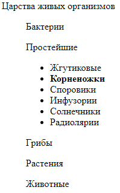

# Components. Homework.

### **1. Разработать пользовательский компонент меню**

- Разработать пользовательский компонент `tree-menu`
- Компонент должен содержать слоты `title` (подставляется ``) и `item` (подставляются `<li>` или `tree-menu`)
  - Предусмотреть возможность вложенности структуры (`item` является другим `tree-menu`)
- Для наполнения *Shadow DOM* необходимо использовать `<template>`
- По умолчанию все `item` скрыты, виден только `title`
- По нажатию на `title` открываются\скрываются `item`
- По нажатию на `item` генерируется собственное событие `"select"` на компоненте `tree-menu`
- Стилизовать элемент:
  - Для `title` и `item` установить `cursor: pointer;`
  - Для `title` и `item` на состояние `:hover` установить `font-weight: bold;`
  

---

    

        Пример внешнего видa
    

    

    

        Пример содержания
    

    Царства живых организмов
    <ul>
        <li>Бактерии</li>
        <ul>
            <li>Эндоспоры</li>
        </ul>
        <li>Простейшие</li>
        <ul>
            <li>Жгутиковые</li>
            <li>Корненожки</li>
            <li>Споровики</li>
            <li>Инфузории</li>
            <li>Солнечники</li>
            <li>Радиолярии</li>
        </ul>
        <li>Грибы</li>
        <ul>
            <li>Хитридиомицеты</li>
            <li>Зигомицеты</li>
            <li>Аскомицеты</li>
            <li>Базидиомицеты</li>
            <li>Дейтеромицеты</li>
        </ul>
        <li>Растения</li>
        <ul>
            <li>Водоросли</li>
            <li>Мохообразные</li>
            <li>Сосудистые споровые</li>
            <li>Семенные растения</li>
        </ul>
        <li>Животные</li>
        <ul>
            <li>Первичноротые</li>
            <li>Spiralia</li>
            <li>Panarthropoda</li>
            <li>Вторичноротые</li>
        </ul>
    </ul>

    

        Пример использвания
    

    
    <tree-menu id="menu">
        Царства живых организмов
        <tree-menu slot="item">
            Бактерии
            <li slot="item">Эндоспоры</li>
        </tree-menu>
        <tree-menu slot="item">
            Простейшие
            <li slot="item">Жгутиковые</li>
            <li slot="item">Корненожки</li>
            <li slot="item">Споровики</li>
            <li slot="item">Инфузории</li>
            <li slot="item">Солнечники</li>
            <li slot="item">Радиолярии</li>
        </tree-menu>
    </tree-menu>

