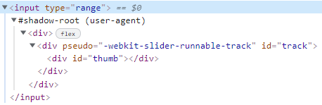

- [Веб-компоненты](#web_components)
- [Пользовательские элементы](#custom_elements)
  - [JavaScript-класс элемента](#custom_elements__class)
  - [Порядок рендеринга](#custom_elements__render_order)
  - [Модифицированные встроенные элементы](#custom_elements__modified)
- [Shadow DOM](#shadow_dom)
  - [Shadow tree](#shadow_tree)
  - [Инкапсуляция](#encapsulation)
- [Template](#template)
- [Композиция](#compose)
  - [Слоты](#slots)
  - [Обновление слотов](#slots__updating)
- [Стилизация Shadow DOM](#shadow_dom_styles)
- [События Shadow DOM](#shadow_dom_events)
- [Источники](#links)


# <a name="web_components"></a>  Веб-компоненты

**Веб-компоненты** - совокупность стандартов, которая позволяет создавать новые, пользовательские HTML-элементы со своими свойствами, методами, инкапсулированными DOM и стилями.

Компонент имеет:
- свой собственный *JavaScript-класс*
- DOM-структура управляется исключительно своим классом, и внешний код не имеет к ней доступа (принцип *инкапсуляции*)
- CSS-стили, применённые к компоненту
- API: события, методы класса и т.п., для взаимодействия с другими компонентами


# <a name="custom_elements"></a>  Пользовательские элементы

Виды пользовательских элементов:
- *Автономные пользовательские элементы* - полностью новые элементы, расширяющие абстрактный класс HTMLElement
- *Пользовательские встроенные элементы* - элементы, расширяющие встроенные, например кнопку HTMLButtonElement


### <a name="custom_elements__class"></a>  JavaScript-класс элемента

Создание класса для нового элемента
```
class MyElement extends HTMLElement {
  constructor() {
    super();
    // элемент создан
  }

  connectedCallback() {
    // браузер вызывает этот метод при добавлении элемента в документ
    // (может вызываться много раз, если элемент многократно добавляется/удаляется)
  }

  disconnectedCallback() {
    // браузер вызывает этот метод при удалении элемента из документа
    // (может вызываться много раз, если элемент многократно добавляется/удаляется)
  }

  static get observedAttributes() {
    return [/* массив имён атрибутов для отслеживания их изменений */];
  }

  attributeChangedCallback(name, oldValue, newValue) {
    // вызывается при изменении одного из перечисленных выше атрибутов
  }

  adoptedCallback() {
    // вызывается, когда элемент перемещается в новый документ
    // (происходит в document.adoptNode, используется очень редко)
  }
}
```

Регистрирация элемента
```
customElements.define("my-element", MyElement);
```

Теперь для любых HTML-элементов с тегом `<my-element>` создаётся экземпляр `MyElement` и вызываются вышеупомянутые методы. Также мы можем использовать `document.createElement('my-element')` в JavaScript

**Примечания:**
- *Имя пользовательского элемента должно содержать дефис `-`*
- *до вызова `customElements.define` элемент считается неопределённым (`:not(:defined)`)*
- *`customElements.get(name)` - возвращает класс пользовательского элемента с указанным именем name*
- *`customElements.whenDefined(name)` – возвращает промис, который переходит в состояние «успешно выполнен» (без значения), когда определён пользовательский элемент с указанным именем `name`*
- *Рендеринг происходит не в `constructor`, а в `connectedCallback`*


### <a name="custom_elements__render_order"></a>  Порядок рендеринга

Элементы обрабатываются друг за другом, **родители до детей**


### <a name="custom_elements__modified"></a>  Модифицированные встроенные элементы

*Новые элементы не имеют связанной с ними семантики. Они не известны поисковым системам, а устройства для людей с ограниченными возможностями не могут справиться с ними*

Наследование от базового класса
```
class AlertButton extends HTMLButtonElement { }
```

Регистрирация элемента *(Бывает, что разные теги имеют одинаковый DOM-класс, поэтому указание тега необходимо)*
```
customElements.define("alert-button", AlertButton, {extends: "button"});
```


Использование элемента
```
<button is="alert-button"></button>
```


# <a name="shadow_dom"></a>  Shadow DOM

**Shadow DOM** используется для инкапсуляции. Благодаря ему в компоненте есть собственное "shadow" DOM-дерево, к которому нельзя просто так обратиться из главного документа, у него могут быть изолированные CSS-правила и т.д.

Браузер рисует их своими силами и по своему усмотрению. Их DOM-структура обычно видна, но в инструментах разработчика можно её посмотреть. К примеру, в *Chrome* для этого нужно активировать пункт `Show user agent shadow DOM`

`<input type="range">`


- доступа к теневому DOM встроенных элементов нету (это не просто обычные потомки, это мощное средство инкапсуляции)

- `pseudo` - нестандартный атрибут (существует по историческим причинам). С его помощью можно стилизовать подэлементы через CSS (`input::-webkit-slider-runnable-track { background: red; }`)


### <a name="shadow_tree"></a>  Shadow tree

Каждый DOM-элемент может иметь 2 типа поддеревьев DOM:
- **Light tree** - обычное DOM-поддерево, состоящее из HTML-потомков
- **Shadow tree** - скрытое DOM-поддерево, не отражённое в HTML, скрытое от посторонних глаз

*Если у элемента имеются оба поддерева, браузер отрисовывает только теневое дерево*

Создание теневого дерева
```
elem.attachShadow({mode: …})
```

Ограничения:
- Для каждого элемента можно создать только один shadow root
- В качестве `elem` может быть использован пользовательский элемент (*Custom Element*), либо один из следующих элементов: `article`, `aside`, `blockquote`, `body`, `div`, `footer`, `h1…h6`, `header`, `main` `nav`, `p`, `section` или `span`

Свойство `mode` задаёт уровень инкапсуляции:
- `open` - корень теневого дерева доступен как `elem.shadowRoot` (любой код может получить теневое дерево)
- `closed` - `elem.shadowRoot` всегда возвращает `null` (д*о теневого DOM в таком случае можно добраться только по ссылке, которую возвращает `attachShadow` (и, скорее всего, она будет спрятана внутри класса). Встроенные браузерные теневые деревья, такие как у `<input type="range">`, закрыты. До них не добраться*)


### <a name="encapsulation"></a>  Инкапсуляция

Теневой DOM отделён от главного документа:
- Элементы теневого DOM не видны из обычного DOM через `querySelector`. В частности, элементы теневого DOM могут иметь такие же идентификаторы, как у элементов в обычном DOM. Они должны быть уникальными только внутри теневого дерева.
- У теневого DOM свои стили. Стили из внешнего DOM не применятся


# <a name="template"></a>  Template

`<template>` предназначен для хранения шаблона HTML
- браузер полностью игнорирует его содержимое
- браузер проверяет синтаксис
- может содержать любой корректный HTML-код, даже такой, который обычно нуждается в специальном родителе
- может содержать стили и скрипты
  - стили не применяются
  - скрипты не запускаются
- `template.content` - содержит контент темплейта

# <a name="compose"></a>  Композиция

### <a name="slots"></a>  Слоты
В теневом DOM `<slot name="X">` определяет «точку вставки» - место, где отображаются элементы с `slot="X"`
```
<script>
    customElements.define("user-card", class extends HTMLElement {
        connectedCallback() {
            const tmpl = document.getElementById("tmpl__user-card");
            this.attachShadow({mode: "open"});
            this.shadowRoot.append(tmpl.content.cloneNode(true));
      }
    });
</script>
    
<template id="tmpl__user-card">
    <div>
        Имя: <slot name="username"></slot>
    </div>
    <div>
        Дата рождения: <slot name="birthday"></slot>
    </div>
</template>

<user-card>
    <span slot="username">Иван Иванов</span>
    <span slot="birthday">01.01.2001</span>
</user-card>
```

Замечания:
- Атрибут `slot="X"` могут иметь только дети первого уровня
- Если в светлом DOM есть несколько элементов с одинаковым именем слота, они добавляются в слот один за другим
- Содержимое слота по умолчанию: `<slot name="username">[DEFAUTL CONTENT]</slot>`
- Первый `<slot>` в теневом дереве без атрибута name является слотом по умолчанию (отображает данные со всех узлов светлого дерева, не добавленные в другие слоты)


### <a name="slots__updating"></a>  Обновление слотов

- Браузер наблюдает за слотами и обновляет отображение при добавлении и удалении элементов в слотах
- Поскольку узлы светлого DOM-дерева не копируются, а только отображаются в слотах, изменения внутри них сразу же становятся видны
- `slotchange` - событие для отслеживания изменения в слотах

([Обновление слотов](https://learn.javascript.ru/slots-composition#obnovlenie-slotov))


### <a name="slots__api"></a>  API слотов

- `node.assignedSlot` - возвращает элемент `<slot>`, в котором находится node
- `slot.assignedNodes({flatten: true/false})` - DOM-узлы, которые находятся в слоте. Опция `flatten` имеет значение по умолчанию `false`. Если явно изменить значение на true, она просматривает развёрнутый DOM глубже и возвращает вложенные слоты, если есть вложенные компоненты, и резервный контент, если в слоте нет узлов
- `slot.assignedElements({flatten: true/false})` - DOM-элементы, которые находятся в слоте (то же самое, что выше, но только узлы-элементы)

([API слотов](https://learn.javascript.ru/slots-composition#api-slotov))


# <a name="shadow_dom_styles"></a>  Стилизация Shadow DOM

- `:host` - позволяет выбрать элемент-хозяин (элемент, содержащий теневое дерево) (приоритетнее стили из документа)
- `:host(selector)` - позволяет выбрать элемент-хозяин если тот подходит под селектор `selector`

Стилизация слотов:
- `slot[name="X"]` - использовать наследование CSS
- `::slotted(selector)`
  - слотовый элемент, пришедший из светлого DOM (элемент вставленный в `<slot>`)
  - элемент соответствует селектору
**НЕ ВЫБИРАЕТ ДОЧЕРНИЕ ЭЛЕМЕНТЫ СЛОТОВ**

CSS переменные:
Пользовательские свойства CSS существуют одновременно на всех уровнях, как светлом, так и в тёмном DOM


# <a name="shadow_dom_events"></a>  События Shadow DOM

1. События, которые произошли в теневом DOM, но пойманы снаружи этого DOM, имеют элемент-хозяин в качестве целевого элемента `event.target`

2. Подмена целевого элемента не происходит, если событие берёт начало на элементе из слота, который фактически находится в обычном, светлом DOM

### <a name="shadow_dom_events__propagation"></a>  Всплытие

Для обеспечения всплытия событий используется развёрнутый DOM

`event.composedPath()` - возвращает полный путь к изначальному целевому элементу, со всеми теневыми элементами

*Детали теневого DOM-дерева доступны только для деревьев с `{mode:'open'}`*

`event.composed` - регулирует всплытие события сквозь границу теневого DOM
`event.bubbles`- указывает является ли данное событие всплывающим внутри DOM


*Генерируя своё событие, чтобы оно всплывало за пределы компонента, нужно установить оба свойства: `bubbles` и `composed` – в значение `true`*


---

# <a name="links"></a>  Источники

[Веб-компоненты](https://learn.javascript.ru/web-components)