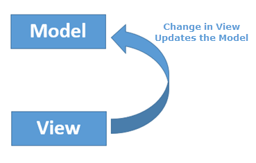
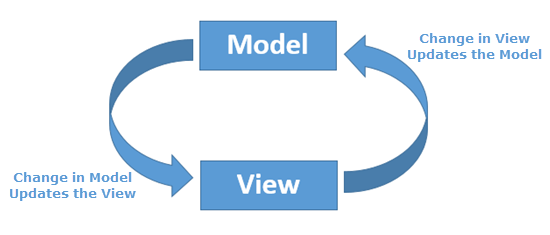

- [MVC](#mvc)
- [Роутинг](#routing)
- [Data Binding](#data-binding)
- [reactive-programming](#data-binding)

#   MVC

**MVC** - подход к проектированию приложения, который предполагает выделение кода в блоки модель, представление и контроллер

- **Модель (Model)** - предоставляет данные и реагирует на команды контроллера, изменяя своё состояние
- **Представление (View)** - отвечает за отображение данных модели пользователю, реагируя на изменения модели
- **Контроллер (Controller)** - интерпретирует действия пользователя, оповещая модель о необходимости изменений

[Что такое MVC](https://ru.hexlet.io/blog/posts/chto-takoe-mvc-rasskazyvaem-prostymi-slovami)

#   Роутинг

**Routing** - маршрутизация - организация маршрутов

**window.history** является свойством только для чтения, ссылающимся на объект `history`, который предоставляет интерфейс для манипулирования историей сессии браузера (страницы, посещённые в текущей вкладке или фрейме, который был загружен на текущей странице)

- `window.history.length` - количество записей в текущей сессии истории
- `window.history.state` - возвращает текущий объект истории
- `window.history.go(n)` - метод, позволяющий гулять по истории. В качестве аргумента передается смещение, относительно текущей позиции. Если передан 0, то будет обновлена текущая страница. Если индекс выходит за пределы истории, то ничего не произойдет.
- `window.history.back()` - метод, идентичный вызову go(-1)
- `window.history.forward()` - метод, идентичный вызову go(1)
- `window.history.pushState(data, title url)` - добавляет элемент истории
- `window.history.replaceState(data, title url)` - обновляет текущий элемент истории

[History API](https://developer.mozilla.org/ru/docs/Web/API/History_API)

#   Data Binding

**Связывание данных** - это процесс, который устанавливает соединение между UI (пользовательским интерфейсом) приложения и бизнес-логикой

[Связывание данных](https://ru.wikipedia.org/wiki/%D0%A1%D0%B2%D1%8F%D0%B7%D1%8B%D0%B2%D0%B0%D0%BD%D0%B8%D0%B5_%D0%B4%D0%B0%D0%BD%D0%BD%D1%8B%D1%85)

#   Реактивное программирование

**Реактивное программирование** - парадигма программирования, ориентированная на потоки данных и распространение изменений

---
Прочие ссылки:

[Build a Simple MVC App From Scratch in JavaScript](https://www.taniarascia.com/javascript-mvc-todo-app/)

[Model-View-Controller (MVC) на JavaScript](https://alexatnet.com/model-view-controller-mvc-in-javascript_ru/)

[JavaScript: Одностраничное приложение на ванильном JS(SPA)](https://medium.com/@adrianx67/javascript-%D0%BE%D0%B4%D0%BD%D0%BE%D1%81%D1%82%D1%80%D0%B0%D0%BD%D0%B8%D1%87%D0%BD%D0%BE%D0%B5-%D0%BF%D1%80%D0%B8%D0%BB%D0%BE%D0%B6%D0%B5%D0%BD%D0%B8%D0%B5-%D0%BD%D0%B0-%D0%B2%D0%B0%D0%BD%D0%B8%D0%BB%D1%8C%D0%BD%D0%BE%D0%BC-js-spa-56f231450753)