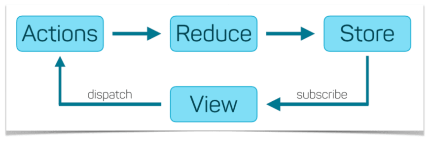

# Flux

**Flux** - архитектурный подход или набор шаблонов программирования для построения пользовательского интерфейса веб-приложений, сочетающийся с реактивным программированием и построенный на однонаправленных потоках данных.

# Redux

**Redux** - библиотека для JavaScript с открытым исходным кодом, предназначенная для управления состоянием приложения. Является модифицированной реализацией подхода Flux



- `Store` - хранит состояние приложения
- `Actions` -  некоторый набор информации, который исходит от приложения к хранилищу и который указывает, что именно нужно сделать. Для передачи этой информации у хранилища вызывается метод dispatch()
- *`Action Creators` - функции, которые создают действия*
- `Reducer` - функция (или несколько функций), которая получает действие и в соответствии с этим действием изменяет состояние хранилища


# React-Redux

### Установка

[Установка](https://react-redux.js.org/introduction/getting-started#installation)
```
npm i redux react-redux lodash.clonedeep
```

### Подключение провайдера

`<Provider/>` - компонент который делает хранилище Redux доступным для приложения

```
...
import { Provider } from 'react-redux'
import store from './store/store'
...

const rootElement = document.getElementById('root')
ReactDOM.render(
  <Provider store={store}>
    <App />
  </Provider>,
  rootElement
)
```

### Создание Store

`./store/store.js`
```
import { createStore } from "redux";
import redcers from "./reducers";

const store = createStore(redcers);

export default store;
```

### Создание Store

`./store/store.js`
```
import { createStore } from "redux";
import reducers from "./reducers";

const store = createStore(reducers);

export default store;
```

### Redux DevTools

[Redux DevTools](https://chrome.google.com/webstore/detail/redux-devtools/lmhkpmbekcpmknklioeibfkpmmfibljd?hl=ru) - для отладки изменений состояния приложения. Расширение предоставляет бонусы процесса разработки Redux. 

```
const store = createStore(
    reducers,
    window.__REDUX_DEVTOOLS_EXTENSION__?.(),
 );
```


### Создание главного Reducer'а

`./store/reducers.js`
```
import { combineReducers } from "redux";

export default combineReducers({
    // [name]: nameReducer
});
```

# Clicker example

### Actions

`./store/clicker/actions.js`
```
export const SET_VALUE = "clicker/SET_VALUE";
export const SHIFT_VALUE = "clicker/SHIFT_VALUE";

export const setValue = (value) => ({
    type: SET_VALUE,
    payload: value,
});

export const shiftValue = (value) => ({
    type: SHIFT_VALUE,
    payload: value,
});
```

### Reducer
`./store/clicker/reducer.js`
```
import cloneDeep from "lodash.clonedeep";
import { 
    SET_VALUE,
    SHIFT_VALUE,
} from "./actions";

const defaultState = {
    value: 0,
};

export const clickerReducer = (state = defaultState, action) => {

    switch (action?.type)
    {
        case SET_VALUE: {
            const clone = cloneDeep(state);
            clone.value = action.payload;
            return clone;
        }
        case SHIFT_VALUE: {
            const clone = cloneDeep(state);
            clone.value += action.payload;
            return clone;
        }
        default: return state;
    }
};
```

### Subscribe

##### Connect
```
...
import { connect } from "react-redux";
import { setValue, shiftValue } from "../../store/clicker/actions";

...
// Clicker implementation
...

const mapStateToProps = (state) => ({
    clickValue: state.clicker.value
})

const mapDispatchToProps = (dispatch) => {
  return {
    increment: () => dispatch({ type: 'INCREMENT' }),
    decrement: () => dispatch({ type: 'DECREMENT' }),
    reset: () => dispatch({ type: 'RESET' }),
  }
}

export default connect(mapStateToProps, mapDispatchToProps)(Clicker)
```


##### Hooks

```
...
import { useDispatch, useSelector } from "react-redux";
import { shiftValue } from "../../store/clicker/actions";

const Clicker = () => {
    const dispatch = useDispatch();
    const clickValue = useSelector(state => state.clicker.value);

    const shiftValue = (arg) => dispatch(shiftValue(arg));

    ...
}

export default Clicker;
```


# Auth example

### Actions

`./store/auth/actions.js`
```
export const SET_ACCOUNT = "auth/SET_ACCOUNT";
export const LOGOUT = "auth/LOGOUT";

export const setAccount = (data) => ({
    type: SET_ACCOUNT,
    payload: data,
});

export const logout = () => ({
    type: LOGOUT,
});
```

### Reducer

`./store/auth/reducer.js`
```
import cloneDeep from "lodash.clonedeep";
import { 
    SET_ACCOUNT,
    LOGOUT,
} from "./actions";

const defaultState = {
    account: JSON.parse(localStorage.getItem("me")),
};

export const authReducer = (state = defaultState, action) => {

    switch (action?.type)
    {
        case SET_ACCOUNT: {
            const clone = cloneDeep(state);
            clone.account = action.payload;
            localStorage.setItem("me", JSON.stringify(action.payload));
            return clone;
        }
        case LOGOUT: {
            const clone = cloneDeep(state);
            clone.account = null;
            localStorage.setItem("me", JSON.stringify(null));
            return clone;
        }
        default: return state;
    }
};
```

# Redux Thunk

`Redux Thunk` - это промежуточное ПО, позволяющее вызывать `Action`, который возвращает функцию вместо объекта действия. Эта функция получает `dispatch`, который затем используется для обработки регулярных синхронных действий внутри тела функции после выполнения асинхронных операций

### Установка

```
npm i redux-thunk redux-devtools-extension
```

### Внедрение

```
import { createStore, applyMiddleware } from "redux";
import thunk from 'redux-thunk';
import { composeWithDevTools } from 'redux-devtools-extension';
import reducers from "./reducers";

const store = createStore(
    reducers,
    composeWithDevTools(applyMiddleware(thunk)),
 );
export default store;
```

### Использование 

`./store/auth/actions.js`
```
export const setLoginStatus = (status) => ({
    type: SET_LOGIN_STATUS,
    payload: status,
})

export const login = (login, password) => async (dispatch) => {
    dispatch(setLoginStatus(LOADING));
    try {
        // await new Promise(resolve => setTimeout(resolve, 2000));
        const response = await authApi.login(login, password);
        dispatch(setAccount(response.data.user));
        dispatch(setLoginStatus(SUCCESS));
    } catch {
        dispatch(setLoginStatus(FAILED));
    }
}
```
