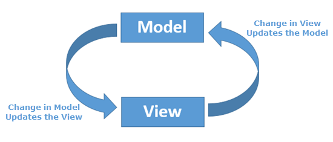

- [MVC](#mvc)
- [Роутинг](#routing)
- [Data Binding](#data-binding)
- [reactive-programming](#data-binding)
- [SPA (Single Page Application)](#single-page-application)
- [Webpack](#webpack)

#   MVC

**MVC** - подход к проектированию приложения, который предполагает выделение кода в блоки модель, представление и контроллер

- **Модель (Model)** - предоставляет данные и реагирует на команды контроллера, изменяя своё состояние
- **Представление (View)** - отвечает за отображение данных модели пользователю, реагируя на изменения модели
- **Контроллер (Controller)** - интерпретирует действия пользователя, оповещая модель о необходимости изменений

[Что такое MVC](https://ru.hexlet.io/blog/posts/chto-takoe-mvc-rasskazyvaem-prostymi-slovami)

#   Роутинг

**Routing** - маршрутизация - организация маршрутов

**window.history** является свойством только для чтения, ссылающимся на объект `history`, который предоставляет интерфейс для манипулирования историей сессии браузера (страницы, посещённые в текущей вкладке или фрейме, который был загружен на текущей странице)

- `window.history.length` - количество записей в текущей сессии истории
- `window.history.state` - возвращает текущий объект истории
- `window.history.go(n)` - метод, позволяющий гулять по истории. В качестве аргумента передается смещение, относительно текущей позиции. Если передан 0, то будет обновлена текущая страница. Если индекс выходит за пределы истории, то ничего не произойдет.
- `window.history.back()` - метод, идентичный вызову go(-1)
- `window.history.forward()` - метод, идентичный вызову go(1)
- `window.history.pushState(data, title url)` - добавляет элемент истории
- `window.history.replaceState(data, title url)` - обновляет текущий элемент истории

[History API](https://developer.mozilla.org/ru/docs/Web/API/History_API)

#   Data Binding

**Связывание данных** - это процесс, который устанавливает соединение между UI (пользовательским интерфейсом) приложения и бизнес-логикой

[Связывание данных](https://ru.wikipedia.org/wiki/%D0%A1%D0%B2%D1%8F%D0%B7%D1%8B%D0%B2%D0%B0%D0%BD%D0%B8%D0%B5_%D0%B4%D0%B0%D0%BD%D0%BD%D1%8B%D1%85)

#   Реактивное программирование

**Реактивное программирование** - парадигма программирования, ориентированная на потоки данных и распространение изменений

#   SPA (Single Page Application)

### MPA
**Multi Page Applications(MPA)** - это многостраничные приложения, работающие, как привычные нам веб-сайты. Они отправляют запрос на сервер и полностью обновляют страницу, когда с ней совершается какое-либо действие (переход на другую страницу, внесение и изменение данных). Подобная архитектура приложения значительно влияет на скорость и производительность, поскольку большая часть данных подгружается повторно при каждом переходе

Преимущества
- **Простая SEO-оптимизация** - MPA часто используют сайты, для которых важно попадать в топы поисковых систем. Каждая из страниц имеет уникальный URL и стабильна, что позволяет поисковым ботам адекватно ее просканировать
- **Масштабируемость** - В MPA приложение можно вложить столько информации, сколько потребуется, без ограничений по страницам и функциям
- **Проверенная классика** - MPA работают по тем же принципам, что и знакомые пользователю веб-сайты с классической навигацией

Недостатки
- **Низкая скорость разработки** - MPA приложения требуют использования фреймворков на обеих сторонах: клиента и сервера. Также из-за тесной взаимосвязи frontend и backend усложняется работа разработчиков. Всё это в совокупности увеличивает бюджет и сроки разработки
- **Затраты на создание мобильного приложения** - MPA приложения плохо конвертируются в мобильные. Для этого в значительной части случаев потребуется разработка backend с нуля

### SPA
**Single Page Application(SPA)** -  это одностраничное приложение, содержащее HTML-страницу, которая динамически (без полной перезагрузки) обновляется в ответ на действия пользователя. Архитектура приложения устроена так, что при первоначальном запуске посетитель видит основной контент сайта в браузере, а новые данные загружаются на ходу по мере необходимости, например, при прокрутке или клике на иконку

Преимущества
- **лёгкость создания** - Для разработки SPA приложения уже готовы библиотеки и фреймворки, работа над frontend и backend может вестись параллельно. Кроме того, на основе готового кода в дальнейшем можно построить мобильное приложение
- **гибкость пользовательского интерфейса** - Для одной страницы проще разработать увлекательный и интерактивный дизайн интерфейса
- **простое кэширование данных** - Важные данные загружаются в один запрос, а далее пользователь одностраничного приложения может работать частично оффлайн, подключаясь к интернету, чтобы сохранить прогресс

Недостатки
- **плохо поддаются SEO оптимизации** - URL страниц практически не меняется, а данные подгружаются динамически, когда для оптимизации важна устойчивость и уникальные URL для каждой страницы. Поисковым ботам сложно просканировать SPA приложение, и на данный момент грамотно индексировать такие сайты умеет только Google
- **сильно нагружают браузер** - Такая проблема возникает из-за относительно "тяжёлых" клиентских фреймворков
- **могут недёшево стоить** - Разумеется, итоговая стоимость разработки разнится, но цена сложных сайтов довольно высока

### SPA VS MPA
- **SPA** выгодны для создания быстрого сайта и броского, многофункционального API интерфейса, внутри которого требуется разместить небольшой объем данных. Такой подход идеален для социальных сетей и SaaS-бизнеса
- **MPA** хороши для подачи большого количества информации и развертки широкого функционала в пределах веб-приложения

[Multi page application](https://developer.mozilla.org/ru/docs/Web/HTML)
[Single page application](https://habr.com/ru/all/)

#   Webpack

`html-loader` - Экспортирует HTML как строку. HTML минимизируется, когда этого требует компилятор

---
Прочие ссылки:

[Build a Simple MVC App From Scratch in JavaScript](https://www.taniarascia.com/javascript-mvc-todo-app/)

[Model-View-Controller (MVC) на JavaScript](https://alexatnet.com/model-view-controller-mvc-in-javascript_ru/)

[JavaScript: Одностраничное приложение на ванильном JS(SPA)](https://medium.com/@adrianx67/javascript-%D0%BE%D0%B4%D0%BD%D0%BE%D1%81%D1%82%D1%80%D0%B0%D0%BD%D0%B8%D1%87%D0%BD%D0%BE%D0%B5-%D0%BF%D1%80%D0%B8%D0%BB%D0%BE%D0%B6%D0%B5%D0%BD%D0%B8%D0%B5-%D0%BD%D0%B0-%D0%B2%D0%B0%D0%BD%D0%B8%D0%BB%D1%8C%D0%BD%D0%BE%D0%BC-js-spa-56f231450753)

[Что такое SPA, MPA и PWA](https://www.azoft.ru/blog/spa-mpa-pwa/)

[html-loader](https://webpack.js.org/loaders/html-loader/)