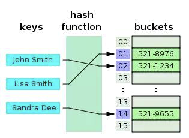
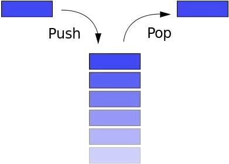
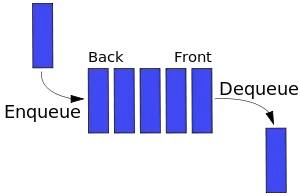
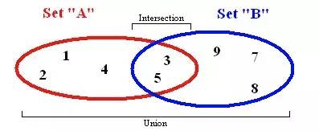

- [Хэш-таблица](#hash__table)
- [Стэк](#stack)
- [Очередь](#queue)
- [Set](#set)
- [Map](#map)
- [WeakMap и WeakSet](#weak__set__map)

#   Хэш-таблица

**Хэш-таблица** — это структура данных, которая строится по принципу ключ-значение

- **`Hash function`** — преобразует ключи в список номеров, которые используются как имена (значения) ключей
- **`O(1)`** — время поиска значения по ключу может достигать `O(1)`

Методы:
 - `add`: добавить пару ключ/значение
 - `remove`: удалить пару
 - `lookup`: найти значение по ключу

#   Стэк

**LIFO** — Last In First Out — последним вошел, первым вышел

Методы:
- `push`: добавить новый элемент
- `pop`: вернуть верхний элемент и удалить его
- `peek`: вернуть верхний элемент
- `length`: вернуть количество элементов в стеке

#   Очередь

**FIFO** — First In First Out — первым вошел, первым вышел

Методы:
- `enqueue`: добавить элемент в конец
- `dequeue`: вернуть первый элемент и удалить его
- `front`: вернуть первый элемент
- `size`: вернуть количество элементов в очереди
- `isEmpty`: проверить, пуста ли очередь

#   Set

**Коллекция (Set)** — коллекция, которая не допускает включения повторяющихся элементов и не содержит индексов

Методы:
- `add`: добавить элемент
- `delete`: удалить элемент
- `has`: проверить, имеется ли элемент в коллекции
- `values`: вернуть все элементы в коллекции
- `size`: вернуть количество элементов
- `union`: вренуть объединения двух коллекций
- `intersection`: вренуть пересечание двух коллекций
- `difference`: вернуть разность двух коллекций
- `subset`: проверить, является ли одна коллекция подмножеством другой

*`add` и `delete` возвращают `true` или `false` в зависимости от успеха операции*

#   Map 

**Map** – это коллекция ключ/значение, как и Object. Но основное отличие в том, что Map позволяет использовать ключи любого типа.

Методы:
- `set(key, value)` – записывает по ключу `key` значение `value`
- `get(key)` – возвращает значение по ключу
- `has(key)` – возвращает `true`, если ключ `key` присутствует в коллекции, иначе `false`
- `delete(key)` – удаляет элемент по ключу `key`
- `clear()` – очищает коллекцию от всех элементов
- `map.size` – возвращает текущее количество элементов

#   Map 

[WeakMap и WeakSet](https://learn.javascript.ru/weakmap-weakset)